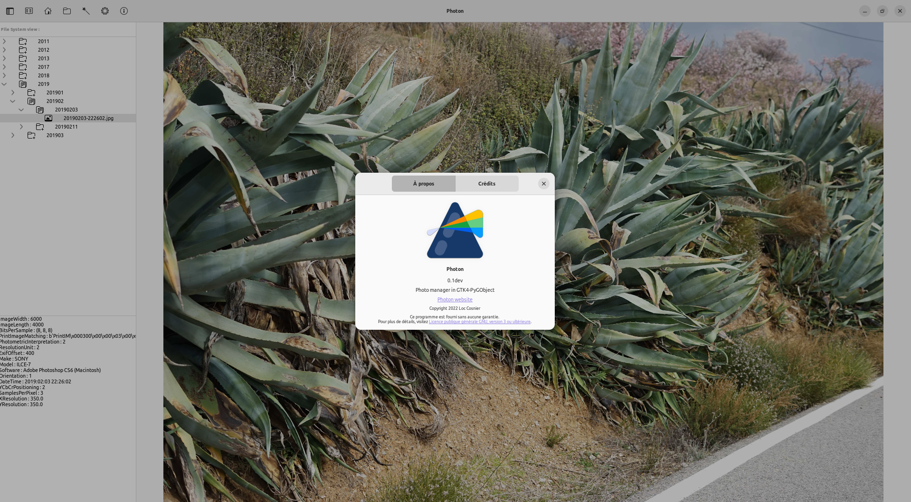

# Photon

This project started as a script to organize and rename my photos with exif datas.

It evolved as a desktop application with GTK and PyGobject mainly to learn GTK programming :) and some image processing functions with Python (Pillow, scikit-image, OpenCV).

Still a lot to do ...

At the moment, most of the features are done with keyboard shortcuts.

